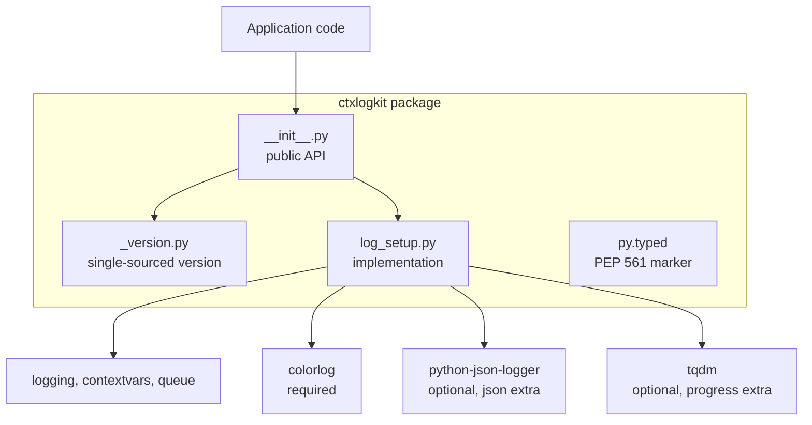
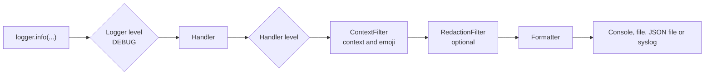
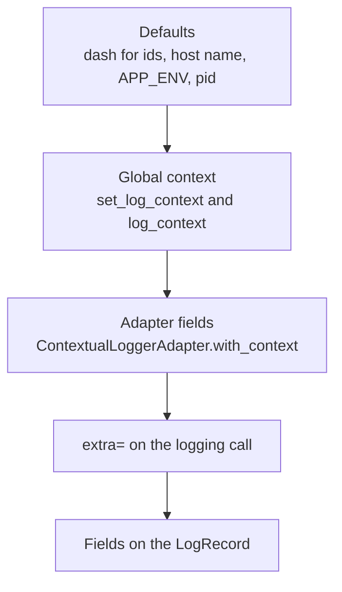
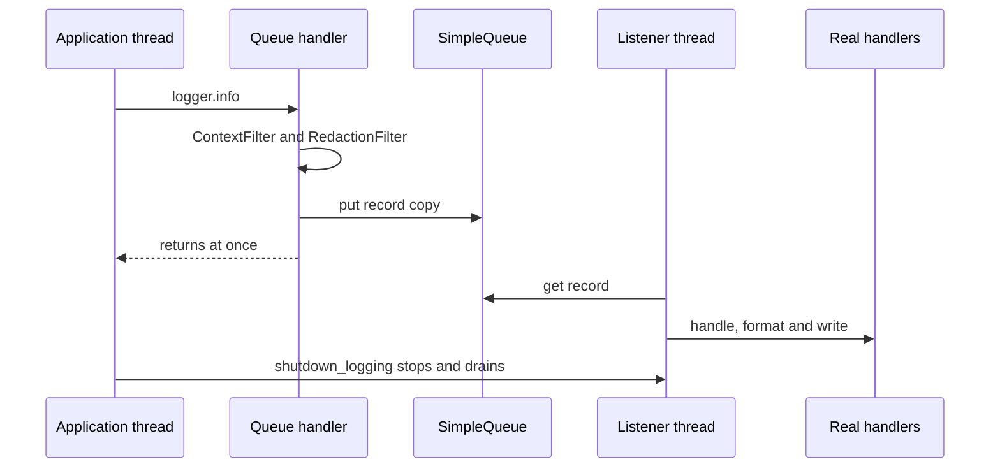

# Architecture

This document explains how `ctxlogkit` is put together and why. It is written for contributors and for
users who want to know exactly what happens between a logging call and the bytes on disk. For usage,
see the [README](../README.md).

## Overview

`ctxlogkit` is a thin layer over the standard library's `logging` package. It does not replace
loggers, levels or handlers. It configures them consistently and adds three things: context fields on
every record, a stable set of output formats, and a few opt-in behaviours (queueing, redaction and
environment configuration).

The whole implementation is one module, `ctxlogkit/log_setup.py`, re-exported from the package root.

## Public API

Everything in `ctxlogkit.__all__` is public. The rest of `log_setup.py` is private, marked by a leading
underscore.

| Area | Names |
| --- | --- |
| Configuration | `setup_logging`, `shutdown_logging`, `setup_syslog_logger` (deprecated) |
| Context | `set_log_context`, `clear_log_context`, `get_log_context`, `log_context`, `ContextualLoggerAdapter` |
| Filters | `RedactionFilter`, `DEFAULT_REDACT_KEYS` |
| Helpers | `log_exception`, `log_duration`, `tqdm_logging` |
| Metadata | `__version__` |

## The life of a log record

`setup_logging()` builds a list of handlers, then attaches the same filters to each of them. A record
travels through the logger, the filters and a formatter before it is written.

Design points that follow from this:

- The logger itself is always set to `DEBUG`. Each handler applies its own level, which is how
  `console_level`, `file_level`, `json_level` and `syslog_level` can differ.
- Filters are attached to the **handlers**, not the logger. A logger-level filter is skipped for
  records that propagate up from child loggers such as `logging.getLogger("app.db")`, whereas a handler
  filter sees every record the handler emits.
- `propagate` defaults to `False` because the logger owns its handlers. Propagating would write
  every record twice when the root logger also has handlers.
- `setup_logging()` is idempotent. It closes and removes the handlers of the previous call before
  adding new ones, so calling it from several places neither duplicates output nor leaks file
  descriptors.

### Handlers and formats

| Output | Handler | Formatter |
| --- | --- | --- |
| Console, verbose | `StreamHandler` | `SmartFieldFormatter` with colour |
| Console, compact | `StreamHandler` | `logging.Formatter` with `[LEVEL] message` |
| Console, JSON | `StreamHandler` | JSON formatter |
| Text file | `RotatingFileHandler` or `TimedRotatingFileHandler` | `SmartFieldFormatter`, `no_color=True` |
| JSON file | `RotatingFileHandler` | JSON formatter |
| Syslog | `SysLogHandler` | `SmartFieldFormatter`, `no_color=True` |

`SmartFieldFormatter` extends `colorlog.ColoredFormatter`. Before formatting it builds a `context`
field containing only the values that are set, as `[key=value]`, so records without context carry no
placeholder text. It removes that field again afterwards, because a record is shared between handlers
and a leftover helper field would leak into JSON output.

`colorlog` appends a reset code to every line, so the file and syslog formatters turn colour off
explicitly. Console colour is enabled only when the stream is a terminal, `NO_COLOR` is unset and `TERM`
is not `dumb`, unless `FORCE_COLOR` is set.

## Context

Context fields (`user_id`, `session_id`, `request_id`, `hostname`, `env`, `pid`) are applied in three
layers. Later layers win.

- `ContextualLoggerAdapter.process()` merges the layers into `extra`, so a record logged through an
  adapter already carries its fields.
- `ContextFilter` fills in the global context for records that did not go through an adapter, for
  example those from plain `logging.getLogger(...)` calls. It only sets attributes that are not
  already on the record, so adapter and `extra` values keep precedence.
- The global context is stored in a `contextvars.ContextVar`. Unlike `threading.local`, it follows
  `asyncio` tasks, so concurrent requests on one thread do not overwrite each other. A new thread
  starts with an empty context, and a task starts with a copy of its parent's.
- `log_context()` sets a new merged value and resets the variable with the token it got, so the
  previous context is restored exactly, even if the block raises, and blocks nest.
- The host name is looked up once and cached, because it can be slow and never changes. `APP_ENV` and
  the process id are read on every call because they are cheap and can change, for example after a
  `fork`.

## Optional behaviour

### Environment configuration

`LOG_LEVEL`, `LOG_FORMAT` and `LOG_FILE` supply values for arguments that were not passed. To tell "not
passed" from "passed the default", the relevant parameters default to `None`, and
`_resolve_environment()` fills them in, in one place. An explicit argument always wins, and
`LOG_FORMAT` is ignored once `mode` or `use_json` is given.

### Non-blocking logging

With `use_queue=True` the logger holds a single `QueueHandler`. A `QueueListener` thread owns the real
handlers and respects their levels.

- The filters run on the **queue handler**, that is on the application thread. The listener thread has
  no access to the caller's context variables, and secrets are masked before a record is queued.
- The stock `QueueHandler` formats the record and drops `exc_info`, which would move tracebacks into
  the message and out of the JSON `exc_info` field. `_QueueHandler` only resolves the message
  arguments, so the real handlers format the record as usual.
- A module-level registry maps logger names to listeners. Reconfiguring a logger, or calling
  `shutdown_logging()`, stops the listener, which drains the queue, and then closes its handlers.
  `shutdown_logging()` is also registered with `atexit`.
- The queue is unbounded. A bounded queue needs a drop or block policy, which has not been needed yet.

### Redaction

`RedactionFilter` masks fields whose name contains a configured key and, optionally, text in the
message that matches a regular expression. It works on a copy of nested containers so the caller's
objects are not modified, and it is idempotent, because the same record passes through it once per
handler. Standard `LogRecord` attributes are never masked. Tracebacks are not searched.

## Optional dependencies

`colorlog` is required. `python-json-logger` and `tqdm` are optional extras, imported inside
`try`/`except ImportError` blocks so that importing `ctxlogkit` never fails because of them. Asking for
JSON output without the library raises an `ImportError` that names the install command.

`python-json-logger` changed between versions, and `_build_json_formatter()` hides the differences.

| Difference | Handling |
| --- | --- |
| Import path (`pythonjsonlogger.json` from 3.1, `pythonjsonlogger.jsonlogger` before) | Try the new path, fall back to the old |
| Field order and the `taskName` field | `_PylogkitJsonFormatter.process_log_record` drops internal fields and puts `timestamp`, `level`, `logger` and `message` first |
| `rename_fields` for `asctime`, `levelname` and `name` | Passed explicitly, so the output keys are stable |

CI runs the tests against the latest release, against 2.0.7, and with neither extra installed.

## Typing and packaging

- The package is fully annotated, ships `py.typed` and is checked with `mypy --strict`. Subclassing the
  untyped `colorlog` and `python-json-logger` classes needs targeted `type: ignore` comments, which
  use `unused-ignore` so they pass whether or not those libraries are typed.
- `from __future__ import annotations` keeps annotations lazy so the code runs on Python 3.10 and later.
  `LoggerAdapter` is only subscriptable at runtime from Python 3.11, so a type-checking-only alias
  is used as the adapter's base class.
- The version is defined once, in `ctxlogkit/_version.py`, and `pyproject.toml` reads it without
  importing the package. See [releasing](releasing.md).

## Testing

Tests live in `tests/` and use `pytest`. They check behaviour through the public API, plus a few
packaging and documentation guarantees.

- An autouse fixture in `conftest.py` clears the log context around every test.
- Tests that need an optional library carry the `json_logger` or `extras` marker and are skipped
  automatically when the library is missing, which is how the "no extras" CI job works.
- `test_readme.py` runs the README's examples and checks that every `setup_logging` argument appears
  in the options table, so the documentation cannot drift from the signature.
- Coverage must stay at or above 90%.

## Extending the package

- **A new `setup_logging` option.** Add the parameter with a docstring entry, document it in the
  README options table (a test enforces this), add a changelog entry and cover it with tests.
- **A new output.** Build the handler and formatter inside `setup_logging()` and append it to the
  `handlers` list. Filters, levels and the queue path then apply to it without further work.
- **A new filter.** Add it to the `filters` list in `setup_logging()`. Keep it idempotent, because a
  record passes through it once per handler, and remember that it must not rely on thread-local state
  if it should work with `use_queue`.
- **A new log field.** Add it to `get_log_context()` and to the formatter strings, and decide whether it
  belongs in the JSON output.
